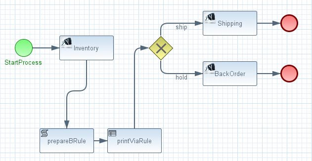

== Overview
This is a modification to the `quickstarts/switchyard/bpm-service` that comes included in JBoss Fuse Service Works 6.0.0.

Purpose of this modification is to introduce a `Business Rules` node into the `ProcessOrder.bpmn` and observe the pInstance variables inserted into working memory.

== Execution

. git clone https://github.com/jboss-gpe-ose/bpm-service.git
. cd bpm-service
. mvn clean install -DskipTests
. deploy `target/switchyard-quickstart-bpm-service.jar`
. vi src/test/java/org/switchyard/quickstarts/bpm/service/BPMClient.java
.. Modify the value of the `URL` constant on line 23 as appropriate
.. save changes
. mvn test exec:java -DskipTests -Dexec.classpathScope="test"

== Results

. The following should be logged in the `server.log` of FSW:
+
-----
2014-09-18 06:10:41,140INFO prepareBRule()    
2014-09-18 06:10:41,141INFO    Parameter = Order
2014-09-18 06:10:41,141INFO        orderId = test1
2014-09-18 06:10:41,141INFO        itemId = cowbell
2014-09-18 06:10:41,142INFO        quantity = 30
2014-09-18 06:10:41,142INFO    Result = null
2014-09-18 06:10:41,142INFO    InventoryAvailable = true
2014-09-18 06:10:41,142INFO    userName = 5395e458a99d3dc685000751
2014-09-18 06:10:41,143INFO    messageId= ID-fsw0-lab2-opentlc-com-31378-1411034447066-2-10
2014-09-18 06:10:41,143INFO retractOrderFromWorkingMemory()    
2014-09-18 06:10:41,145INFO    Order
2014-09-18 06:10:41,145INFO        orderId = test1
2014-09-18 06:10:41,146INFO        itemId = cowbell
2014-09-18 06:10:41,146INFO        quantity = 30
-----

. Notice that the `retractOrderFromWorkingMemory` rule is fired due to the existence of an `Order` object in working memory.
. This `Order` object was injected into working memory via the following in the `prepareBRule` script task of `ProcessOrder.bpmn` :
+
-----
kcontext.getKnowledgeRuntime().insert( Parameter );
-----
